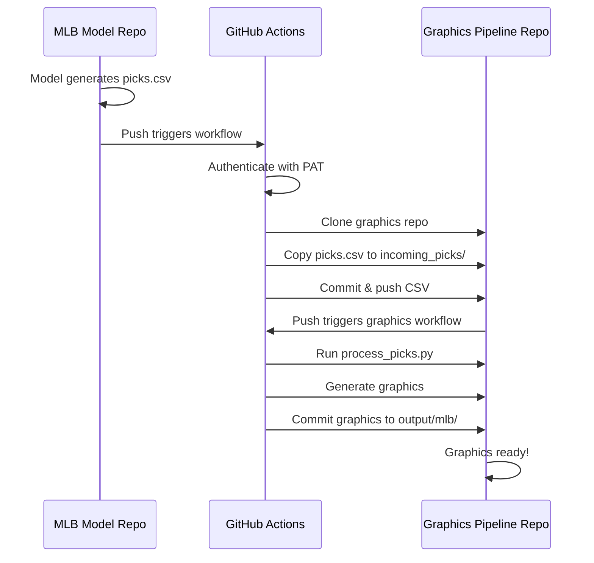

# Cross-Repository Workflow Setup Guide

This guide shows you how to set up automatic graphic generation when your MLB model repo generates picks.

## 🎯 Workflow Overview

```
Your MLB Model Repo                    Graphics Pipeline Repo
━━━━━━━━━━━━━━━━━                    ━━━━━━━━━━━━━━━━━━━━━━
                                      
1. Model generates picks.csv          
                                      
2. GitHub Action triggers              
   ↓                                   
3. Pushes CSV to graphics repo ─────→ 4. Graphics repo receives CSV
                                         ↓
                                      5. Auto-generates graphics
                                         ↓
                                      6. Commits graphics to repo
```

## 📋 Prerequisites

- GitHub account with access to both repositories
- Admin access to the graphics pipeline repo
- Write access to your MLB model repo

---

## Part 1: Graphics Pipeline Repo Setup (THIS REPO)

### Step 1: Enable GitHub Actions Write Permissions

1. Go to your graphics pipeline repo: `https://github.com/Lpchaitin/sports-graphics-pipeline`
2. Click **Settings** → **Actions** → **General**
3. Scroll down to **Workflow permissions**
4. Select: **Read and write permissions** ✓
5. Check: **Allow GitHub Actions to create and approve pull requests** ✓
6. Click **Save**


### Step 2: Test the Workflow

The workflow is already set up in this repo (`.github/workflows/generate-graphics.yml`).

Test it:
```bash
# Create a test picks file
mkdir -p incoming_picks
cp example_picks.csv incoming_picks/test_picks.csv

# Commit and push
git add incoming_picks/test_picks.csv
git commit -m "Test: Add sample picks"
git push
```

Then check: `https://github.com/Lpchaitin/sports-graphics-pipeline/actions`

You should see a workflow run that generates graphics!

---

## Part 2: MLB Model Repo Setup (YOUR MODEL REPO)

### Step 1: Create a Personal Access Token (PAT)

This allows your MLB repo to push files to the graphics repo.

1. Go to **GitHub.com** → Click your profile picture → **Settings**
2. Scroll down to **Developer settings** (bottom left)
3. Click **Personal access tokens** → **Tokens (classic)**
4. Click **Generate new token** → **Generate new token (classic)**
5. Fill in:
   - **Note**: `MLB Model to Graphics Pipeline`
   - **Expiration**: `No expiration` or `1 year` (recommended: set calendar reminder)
   - **Scopes**: Check these boxes:
     - ✓ `repo` (Full control of private repositories)
       - This includes: repo:status, repo_deployment, public_repo, repo:invite, security_events
6. Click **Generate token**
7. **IMPORTANT**: Copy the token now! (It starts with `ghp_...`)
   - You won't be able to see it again
   - Save it temporarily in a secure location

### Step 2: Add Token as Secret to MLB Repo

1. Go to your MLB model repo on GitHub
2. Click **Settings** → **Secrets and variables** → **Actions**
3. Click **New repository secret**
4. Fill in:
   - **Name**: `GRAPHICS_REPO_TOKEN`
   - **Secret**: Paste the token you just created (starts with `ghp_...`)
5. Click **Add secret**

### Step 3: Add the Workflow File to MLB Repo

1. In your MLB repo, create the directory:
   ```bash
   mkdir -p .github/workflows
   ```

2. Copy the template workflow file:
   - From graphics pipeline repo: `.github/workflows/TEMPLATE_send_picks_from_mlb_repo.yml`
   - To MLB repo: `.github/workflows/send-picks-to-graphics.yml`

3. **Edit the workflow file** to match your repo structure:

   ```yaml
   on:
     push:
       paths:
         - 'output/daily_picks.csv'  # ← Change this to YOUR picks file path
   ```

   And verify the repository name:
   ```yaml
   repository: Lpchaitin/sports-graphics-pipeline  # ← Your graphics repo
   ```

4. Commit and push:
   ```bash
   git add .github/workflows/send-picks-to-graphics.yml
   git commit -m "Add workflow to send picks to graphics pipeline"
   git push
   ```

### Step 4: Enable Actions in MLB Repo

1. Go to your MLB repo → **Settings** → **Actions** → **General**
2. Under **Actions permissions**, select:
   - ✓ **Allow all actions and reusable workflows**
3. Click **Save**

---

## 🧪 Testing the Integration

### Test 1: Manual Workflow Dispatch (Easiest)

1. In your **MLB repo**, go to **Actions** tab
2. Click **Send Picks to Graphics Pipeline** (left sidebar)
3. Click **Run workflow** (right side)
4. Select branch and click green **Run workflow** button
5. Watch it run!

After it completes:
- Go to graphics pipeline repo → **Actions** tab
- You should see a new workflow run generating graphics
- Check `output/mlb/` folder for generated graphics

### Test 2: Automatic Trigger (Full Test)

1. In your MLB model repo, generate a picks CSV:
   ```python
   import pandas as pd
   
   picks = pd.DataFrame({
       'date': ['2026-04-20'],
       'away_team': ['NYY'],
       'home_team': ['BOS'],
       'away_ml': ['+135'],
       'home_ml': ['-155'],
       'ou_line': ['9.5'],
       'ml_pick': ['home'],
       'ou_pick': ['OVER']
   })
   
   picks.to_csv('output/daily_picks.csv', index=False)
   ```

2. Commit and push:
   ```bash
   git add output/daily_picks.csv
   git commit -m "Add today's picks"
   git push
   ```

3. The workflow should automatically trigger!
   - Check MLB repo → **Actions** to see pick sending
   - Check graphics repo → **Actions** to see graphic generation

---

## 🔑 Summary of Secrets & Permissions

### Graphics Pipeline Repo
| Setting | Location | Value |
|---------|----------|-------|
| Workflow permissions | Settings → Actions → General | **Read and write permissions** ✓ |
| Allow PRs | Settings → Actions → General | **Allow GitHub Actions to create and approve pull requests** ✓ |

### MLB Model Repo
| Secret/Setting | Location | Value |
|----------------|----------|-------|
| **GRAPHICS_REPO_TOKEN** | Settings → Secrets → Actions | Your PAT (starts with `ghp_...`) |
| Actions permissions | Settings → Actions → General | **Allow all actions and reusable workflows** |

---

## 📂 File Locations

### In Graphics Pipeline Repo:
```
sports-graphics-pipeline/
├── .github/workflows/
│   ├── generate-graphics.yml                    # ✓ Already set up
│   └── TEMPLATE_send_picks_from_mlb_repo.yml   # Template for your MLB repo
├── incoming_picks/                              # CSV files arrive here
│   └── processed/                               # Archived after processing
├── output/mlb/                                  # Generated graphics
└── process_picks.py                             # Batch processor
```

### In Your MLB Model Repo:
```
mlb-model/
├── .github/workflows/
│   └── send-picks-to-graphics.yml              # ← Copy template here
└── output/
    └── daily_picks.csv                          # Your model's picks
```

---

## 🚨 Troubleshooting

### Issue: "Resource not accessible by integration"
**Solution**: Graphics repo needs write permissions
- Graphics repo → Settings → Actions → General
- Enable **Read and write permissions**

### Issue: "Repository not found" or authentication error
**Solution**: Check your PAT
- Ensure `GRAPHICS_REPO_TOKEN` secret is set in MLB repo
- Token must have `repo` scope
- Verify repository name is correct in workflow file

### Issue: Workflow doesn't trigger automatically
**Solution**: Check the path in workflow file
- In MLB repo's workflow, verify the `paths:` matches your picks file location
- Example: If picks are at `data/picks.csv`, use `- 'data/picks.csv'`

### Issue: Graphics not generated
**Solution**: Check CSV format
- Ensure CSV has required columns: `away_team, home_team, away_ml, home_ml, ou_line`
- Team abbreviations must match (see `src/team_data.py` for valid codes)
- Check graphics repo Actions tab for error logs

### Issue: Token expired
**Solution**: Create a new PAT
- When creating PAT, set longer expiration or no expiration
- Update `GRAPHICS_REPO_TOKEN` secret in MLB repo with new token

---

## 🔄 Workflow Diagram



---

## 🎉 What Happens After Setup

Once everything is configured:

1. **Your model runs** and generates `daily_picks.csv`
2. **MLB repo workflow** automatically:
   - Detects the new CSV
   - Pushes it to the graphics pipeline repo
3. **Graphics repo workflow** automatically:
   - Detects the incoming CSV
   - Generates graphics for each game
   - Commits graphics to `output/mlb/`
4. **You can**:
   - Download graphics from the repo
   - Use them in your Substack posts
   - Share on social media
   - Embed in newsletters

**All fully automated!** ✨

---

## 📞 Quick Reference

### View Workflow Runs
- **MLB Repo**: `https://github.com/YOUR_USERNAME/mlb-model/actions`
- **Graphics Repo**: `https://github.com/Lpchaitin/sports-graphics-pipeline/actions`

### Manual Trigger
- Go to Actions tab → Select workflow → Run workflow button

### Check Generated Graphics
- Graphics repo → `output/mlb/` folder
- Or clone repo and check locally

### Update PAT
- GitHub Settings → Developer settings → Personal access tokens
- Regenerate → Update secret in MLB repo

---

## 🔐 Security Best Practices

1. **Use fine-grained tokens** (when available) instead of classic PATs
2. **Set token expiration** and add calendar reminder to renew
3. **Never commit tokens** to your repository
4. **Only grant minimum required permissions**
5. **Rotate tokens periodically** (every 6-12 months)
6. **Use separate tokens** for different integrations

---

## 💡 Advanced Options

### Option 1: Send picks to specific folder by date
Modify the MLB repo workflow to organize by date:
```yaml
DEST_FILE="graphics-pipeline/incoming_picks/$(date +%Y-%m-%d)_picks.csv"
```

### Option 2: Notify on success
Add a Slack/Discord notification step after graphics are generated.

### Option 3: Auto-publish graphics
Add a step to automatically upload graphics to your website or social media.

---

## Next Steps

1. ✅ Set up workflow permissions in graphics repo
2. ✅ Create Personal Access Token
3. ✅ Add PAT as secret to MLB repo
4. ✅ Copy workflow file to MLB repo
5. ✅ Test with manual dispatch
6. ✅ Test with automatic trigger
7. 🎉 Enjoy automated graphics!
